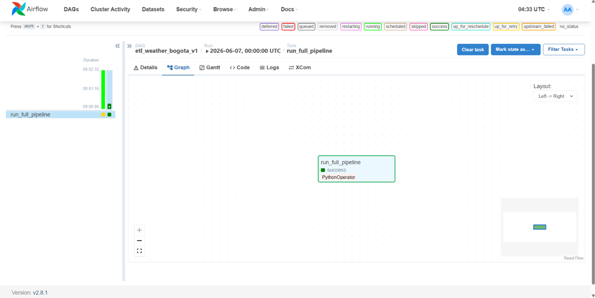
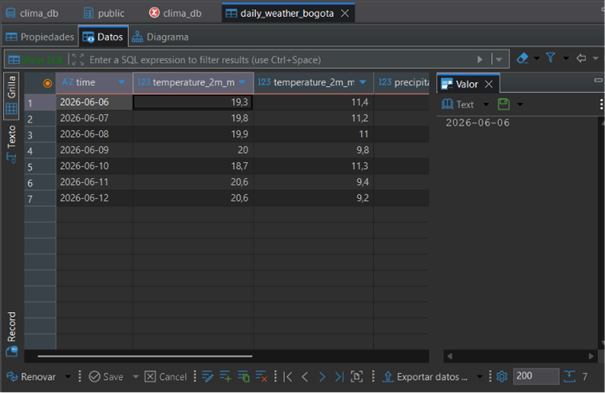

# 🌤️ Automated Weather Data ETL Pipeline
## 📖 Project Overview
This project is an end-to-end ETL (Extract, Transform, Load) pipeline designed to ingest daily weather metrics, process them into an analytical tabular format, and persist them into a relational database for downstream analysis.

The entire workflow is **containerized** using Docker and **orchestrated** via Apache Airflow to ensure reliable, automated daily executions.

## 🏗️ Architecture & Tech Stack
* **Data Source:** [Open-Meteo REST API](https://open-meteo.com/) (Real-time weather data).
* **Language:** Python 3 (Modular script architecture).
* **Data Transformation:** `pandas` (Data cleansing, type casting, and schema standardization).
* **Storage:** PostgreSQL (Relational database deployed in Docker).
* **Workflow Orchestration:** Apache Airflow (DAG scheduling, monitoring, and error handling).
* **Infrastructure:** Docker & Docker Compose.
## 📂 Project Structure
The repository follows software engineering best practices through a modular design:

* `dags/extract.py`: Handles API connectivity and raw data ingestion (HTTP 200 validation).
* `dags/transform.py`: Processes raw JSON responses into structured DataFrames.
* `dags/load.py`: Manages database persistence using `SQLAlchemy`.
* `dags/main.py`: The entry point that orchestrates the entire ETL logic.
* `dags/weather_dag.py`: Airflow DAG definition for scheduling and automation.
* `docker-compose.yml`: Infrastructure for the target PostgreSQL database.
* `docker-compose.yaml`: Official Airflow stack configuration.
## 🚀 Local Setup & Execution
### 1. Clone the repository:
```bash
git clone https://github.com/SalimSaah/weather-etl-pipeline.git
cd weather-etl-pipeline
```
### 2. Spin up the target Database:
```bash
docker-compose -f docker-compose.yml up -d
```
### 3. Initialize and launch Apache Airflow:
```bash
docker-compose -f docker-compose.yaml up airflow-init
docker-compose -f docker-compose.yaml up -d
```
### 4. Access the Airflow UI:
* Open your browser at `http://localhost:8080`
* Username: `airflow` | Password: `airflow`
* Locate the DAG `etl_weather_bogota_v1`, unpause it (toggle), and trigger it manually.
### 5. Verify the Data:
Connect to the local database using DBeaver, pgAdmin, or any SQL client using the following credentials to query the `daily_weather_bogota` table:

* Host: `localhost`
* Port: `5433`
* Database: `clima_db`
* User: `usuario_etl`
* Password: `password123`
## 📸 Visual Demonstration

*Airflow Graph View: Successful execution of the full ETL pipeline.*
\
\

*Final database visualization using DBeaver.*
## 🔮 Roadmap
* Implement Data Quality Tests (Great Expectations or dbt tests).
* Scale the pipeline to ingest data from multiple cities simultaneously.
* Migrate local storage to a Cloud Data Warehouse (e.g., AWS Redshift or Google BigQuery).
* Implement Idempotency logic to prevent data duplication on multiple runs (Upsert strategy).

##
**Developed by <u>Salim Saah</u>**\
*Physics Graduate & Aspiring Data Engineer*
